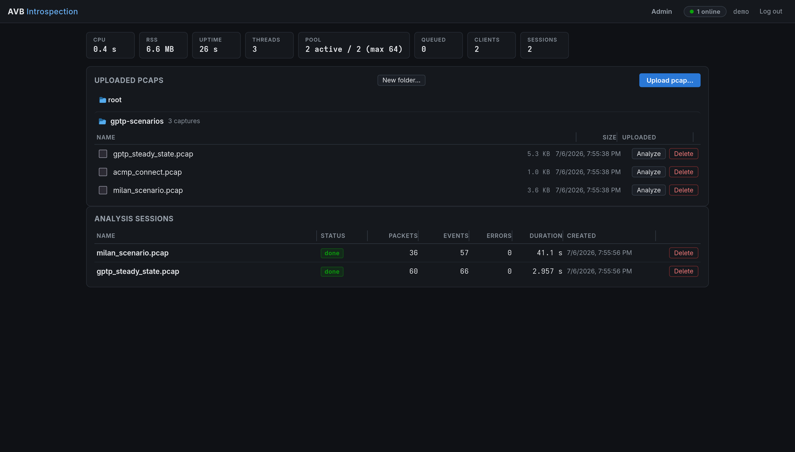
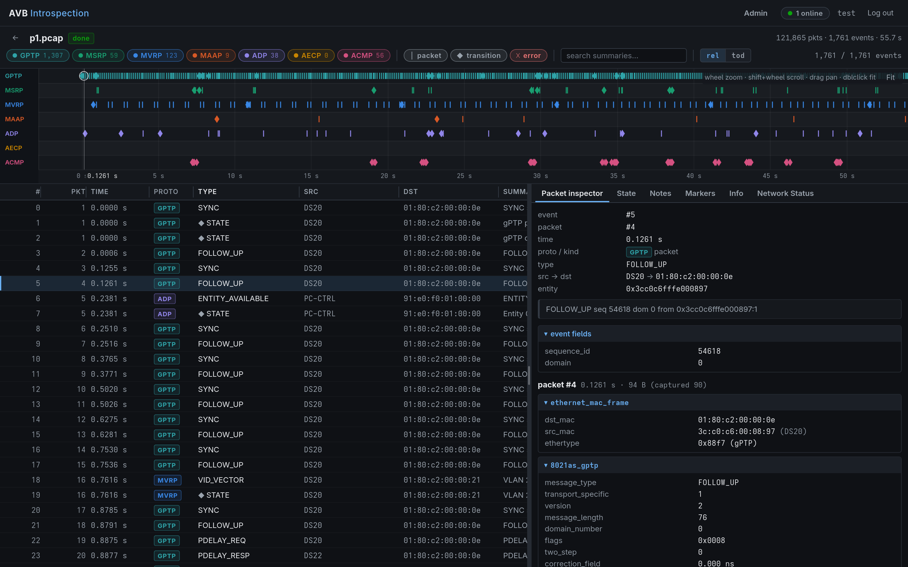
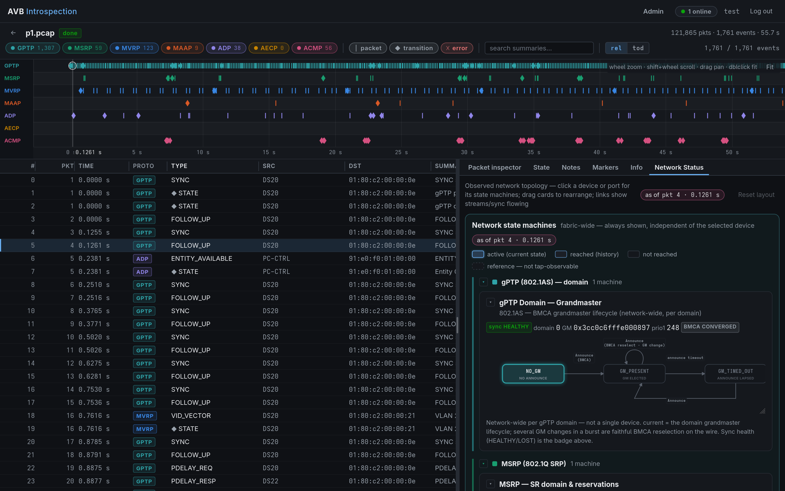
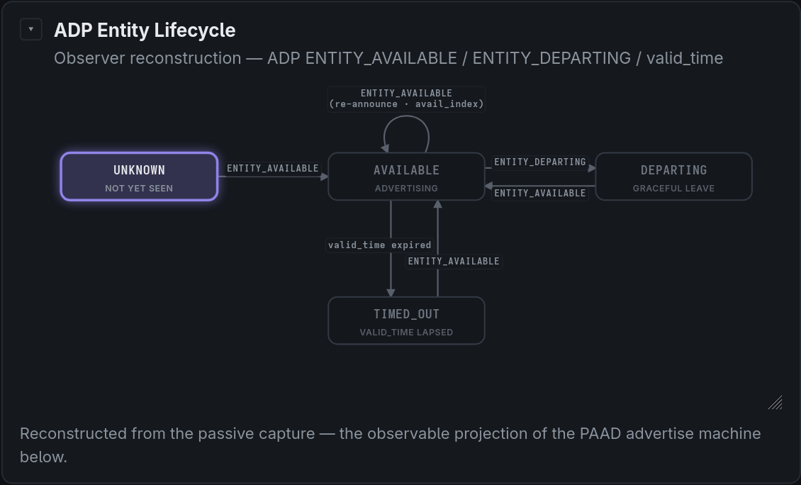
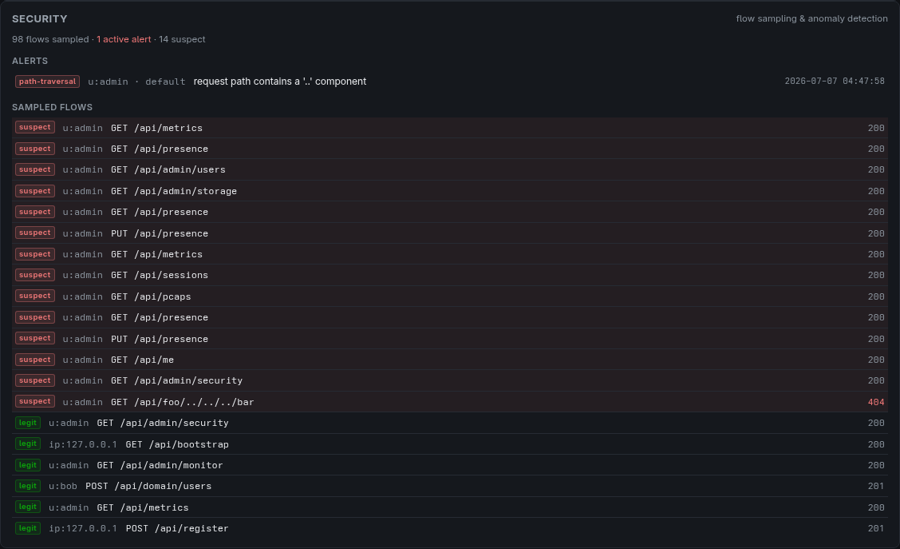

<!-- SPDX-FileCopyrightText: 2026 Kebag-Logic -->
<!-- SPDX-License-Identifier: MIT -->

# AVB Introspection

A Milan-oriented introspection tool for AVB/TSN control protocols: it decodes
**MSRP, MVRP, MAAP, ATDECC (ADP, AECP, ACMP)** and **gPTP (802.1AS)** traffic
from pcap files, reconstructs the protocol state machines (reservations, VLAN
registrations, address claims, entity lifecycles, command correlation, stream
connections, grandmaster election and sync health), correlates them across
protocols (e.g. each entity's announced grandmaster is checked against the
grandmaster actually observed on the wire), and presents events, per-packet
detail, timelines and live state in a web UI.

The **Network Status** view is the single home for the observed topology and
every reconstructed protocol **state machine as a live spec diagram** (Milan
ACMP listener sink, ADP, 802.1AS media-dependent, and the 802.1Q MRP
Applicant/Registrar). It maps the observed devices; click an endstation or port
to see all of its state machines, **grouped per protocol** and each in a
foldable, resizable card. Above the graph it always shows the **network-wide**
machines that belong to no single device — the gPTP domain grandmaster/BMCA
lifecycle, the MSRP SR reservation domain, and MAAP multicast-address claims.
Every diagram overlays the state **as of where the timeline cursor sits**:
select a packet (in the event table or on the timeline) and each machine's
highlighted *current* state — and the sync/stream links and gPTP port roles —
re-time to that moment; with nothing selected they show the final observed
state. Click any **transition** to list the event(s) that drove it, each
linking straight to its triggering packet.

The tool is **multi-user**: several analysts can be logged in and monitoring
in parallel — even inside the same session — each with their own timeline
cursor and filters. The header's presence indicator shows who is online and
which session they are looking at, and shared investigation notes are
conflict-safe under concurrent editing.

The tool is an *observer* — it decodes and correlates traffic; generating
traffic is [TSN-GEN]'s job. See [REQUIREMENTS.md](REQUIREMENTS.md) for the
full requirements, [docs/API.md](docs/API.md) for the API contract, and
[docs/DEPLOYMENT.md](docs/DEPLOYMENT.md) for the deployment guide.

## Screenshots

The pcap library — a file-explorer with folders (drag-and-drop, resizable
columns); compressed captures (`.gz .xz .zst .bz2 .lz4 .lz .zip`) are inflated
on upload:



A session: filterable event table + timeline on the left, the packet inspector
with fully decoded protocol layers on the right:



**Network Status** — the observed topology plus every reconstructed state
machine as a live spec diagram, overlaid with the state *as of the timeline
cursor* (here the gPTP domain grandmaster / BMCA lifecycle):



Each machine is a spec diagram with the observed *current* state highlighted and
every taken transition traced — click a transition to jump to the packet or
event that drove it:



## Quick start

Dependencies: `g++` (C++20), `make`, `zlib`, `libsodium` (and Python 3 for
the test-data generator). See [docs/DEPLOYMENT.md](docs/DEPLOYMENT.md) for
Docker and systemd + nginx deployments.

```bash
make -j                       # -> build/avb-introspectd
AVB_ADMIN_USER=admin AVB_ADMIN_PASSWORD=change-me \
  ./build/avb-introspectd     # listens on :8342, data in ./data
```

Open http://localhost:8342 in Firefox, register an account, upload a pcap
(or open one by server path), and explore. To try it without real traffic:

```bash
python3 tools/gen_pcaps.py    # writes Milan scenarios to testdata/
# then upload testdata/milan_scenario.pcap in the UI
```

### Docker (BE-3)

```bash
docker build -t avb-introspection .
docker run -p 8342:8342 -v avb-data:/data avb-introspection
```

Uploaded pcaps, sessions and user accounts persist in the `/data` volume and
survive restarts (BE-8).

## Using the app

A quick tour of the web UI. On a fresh install the first account you create
becomes the administrator (or provision one with `AVB_ADMIN_USER` /
`AVB_ADMIN_PASSWORD`).

**Home — the pcap library.** *Upload pcap…* adds a capture (plain or
compressed: `.gz .xz .zst .bz2 .lz4 .lz .zip`). The library is a file
explorer: make folders with *New folder…*, open a folder to browse it, and
move a capture by **dragging its row** onto a folder (or the **root**
breadcrumb). Column widths are drag-resizable. Press **Analyze** on a capture
to start a session, or tick several and **Combine** them into one merged
timeline. Admins can **Delete** a capture (existing sessions keep their own
copy). Below the library, *Analysis sessions* lists your sessions — click one
to open it.

**A session — events, timeline, inspector.** The left pane is the event table
(**#** = event index, **Pkt** = number in the original pcap) over a per-protocol
**timeline**. Filter with the protocol/kind chips and the search box; click a
row — or a point on the timeline — to select an event. Everything time-aware
re-times to that moment (the "as of" cursor). The right pane's tabs:

- **Packet inspector** — the selected packet fully decoded, layer by layer.
- **State** — every reconstructed protocol object with its transition history.
  Each transition links to what caused it: **pkt N** (the causing packet) or
  **◆ #i** (a timer/derived state event) — click to jump straight there, even
  if the current filter would otherwise hide it.
- **Network Status** — the observed topology plus every state machine as a live
  spec diagram, overlaid with the state at the cursor. **Drag a device card**
  to rearrange the graph; **drag a link's label** to bend its curve (to
  separate overlapping links); **click a stream's label** to jump to its ACMP
  connection machine. Click any **transition** in a diagram to list the
  event(s) that drove it. Each device has a **⧉ window** button that opens its
  machines in a separate, cursor-tracking browser window. *Reset layout* undoes
  manual moves and bends.
- **Notes** — markdown investigation notes (autosaved, conflict-safe for
  concurrent editors). **Markers** — your own timeline bookmarks. **Info** —
  capture/file/session details and per-device naming.

**Monitoring in parallel.** The tool is built for several users at once:
everyone has their own account, and any number of analysts can open the
**same session simultaneously** — each keeps an independent timeline cursor,
selection and filters, so two people can inspect different moments of the
same capture side by side. The **presence indicator** in the header shows
who is online and which session they are in; **Notes** are shared and
conflict-safe (concurrent edits get a merge prompt, never a silent
overwrite).

**Admin** (admins only) — user management, live presence, per-domain
**Monitoring** (CPU/memory + load), a **Security** panel (flow alerts +
sampled flows), **Domains** (create isolated tenants and assign owners), and
a **Storage** panel. A **domain owner** instead gets a *My domain* view to
manage just their own domain's users. See
[docs/SECURITY.md](docs/SECURITY.md) for exposing the server safely.

## Architecture

```
frontend/            single-page web UI (vanilla JS, Firefox-first)
backend/src/
  pcapio/            pcap + pcapng readers (Ethernet captures)
  decode/            wire-format decoders for the six protocols
  tsn_gen/           vendored TSN-GEN logic-override contract (see below)
  logic/             protocol state machines as TSN-GEN logic modules
  engine/            parallel decode -> ordered single-threaded state pass
  net/               HTTP/1.1 + RFC 6455 WebSocket server (POSIX sockets)
  auth/              accounts, Argon2id password hashes (libsodium)
  store/             on-disk persistence of pcaps + session metadata
  api/               REST endpoints, WS streaming, metrics, static serving
```

Concurrency model (CO-1..4): client connections are served by a thread pool
that grows on demand up to `--max-threads`; captures are partitioned across
CPU cores and decoded in parallel; the decoded packets are then re-ordered
by capture timestamp and fed to the state machines by a single thread —
state reconstruction is order-sensitive, so reordered packets never reach
the logic modules.

The WebSocket event stream uses binary frames, each a zlib (RFC 1950)
stream the browser inflates with `DecompressionStream("deflate")` (OQ-10:
zlib at `Z_BEST_SPEED` — lightweight, native on both ends).

## TSN-GEN integration (BE-2)

TSN-GEN's protocol *logic* layer is an override mechanism: modules subclass
`ILogicModule` (`onEncode` / `onDecode` / `nextLayer`), register with
`REGISTER_LOGIC("<service>", Class)`, and read named vars through a
`LayerContext`. This backend implements every protocol state machine as
exactly such a module (`backend/src/logic/`):

| Service | Module | State reconstructed |
|---|---|---|
| `mrp_msrp` | MsrpLogic | reservation per StreamID, SR domains |
| `mrp_mvrp` | MvrpLogic | VLAN registration per VID |
| `1722_maap` | MaapLogic | address range per claimant (probe/defend) |
| `atdecc_adp` | AdpLogic | entity lifecycle incl. valid_time expiry |
| `atdecc_aecp` | AecpLogic | in-flight commands, timeouts, entity names |
| `atdecc_acmp` | AcmpLogic | stream connection per talker/listener pair |

The three contract headers in `backend/src/tsn_gen/` are vendored unmodified
from TSN-GEN (MIT). TSN-GEN v1 ships `LayerContext::getValue/setValue` as
stubs pending its Stack serializer; `VarLayerContext` here is the working
implementation backed by the decoders' field storage, so the modules run for
real today and can be linked into TSN-GEN unchanged once its serializer
lands. `VarLayerContext::getBytes/setBytes` anticipates TSN-GEN's planned
typed accessors for fields wider than `uint64_t` (e.g. the 64-byte AEM
`entity_name`).

## Investigation sessions

Every analysis session is a self-contained folder under
`data/sessions/<id>/` holding its own copy of the capture plus `notes.md`
— markdown investigation notes seeded from a template and editable in the
UI's **Notes** tab (with preview). Deleting a library upload never breaks
an existing investigation, and notes survive restarts with the session.

**Combining captures.** Several library pcaps can be merged into one session
and timeline: tick them in the library and choose *Combine into a session*
(or `POST /api/sessions {"pcap_ids": [...]}`). The backend merges all packets by
absolute capture time into one `capture.pcap`, which everything downstream then
treats as an ordinary single-file session. Captures uploaded in any order land
on a single chronological timeline: **disjoint** windows keep their real gaps
(e.g. ring-buffer splits, or capture part 1 then part 2), and **overlapping**
windows — such as two tap points watching the same period — are interleaved
packet-by-packet by timestamp. Every packet keeps a tag for the **source
capture** it came from (a per-packet sidecar), shown as a coloured badge in the
inspector; each source gets an editable **alias** (defaulting to its filename)
you can rename in the session's Info tab — handy for labelling tap points.

## Testing

```bash
make -j test                   # unit tests incl. golden-trace runs (TV-1/2)
./scripts/integration_test.sh  # black-box REST+WS test with restart (TV-3)
python3 scripts/e2e_playwright.py   # browser E2E, headless Firefox (TV-4)
```

The browser suite needs Playwright once: `pip install playwright &&
playwright install firefox` (add `--with-deps` on Ubuntu;
on other distros the GTK3/ALSA stack must be present).

`tools/gen_pcaps.py` builds byte-exact golden scenarios per protocol
(including malformed frames — decode errors become events, never crashes,
PA-5). It stands in for TSN-GEN generated traffic; regenerate the scenarios
through TSN-GEN once its serializer lands.

## Server options

```
--port N            listen port                    (default 8342)
--data DIR          persistent data directory      (default ./data)
--frontend DIR      static frontend directory      (default ./frontend)
--max-threads N     serving thread cap (CO-1)      (default 64)
--max-upload-mb N   pcap upload limit              (default 1024)
```

Runtime metrics (NF-2: per-session packet rates, per-client bytes, CPU/RSS,
pool utilisation) are at `GET /api/metrics` and shown on the UI home screen.

## Security, users & admin (SE)

Registration + login are required for every API call; passwords are stored
as Argon2id hashes (libsodium `crypto_pwhash_str`); sessions use random
64-hex bearer tokens. TLS is not terminated by the backend — put a reverse
proxy in front for deployments beyond a trusted lab network (OQ-12).

Accounts have roles (`admin`/`user`). Provision the admin from the
deployment environment — created on first start, or promoted if the
account already exists:

```bash
AVB_ADMIN_USER=alex AVB_ADMIN_PASSWORD=change-me ./build/avb-introspectd
```

Admins get an **Admin** panel: user management, per-domain **Monitoring**
(process CPU/memory and per-domain load), a **Security** panel (flow alerts +
sampled flows), **Domains**, and storage. Everyone sees the presence
indicator in the header, and concurrent notes editing is conflict-safe.

### Multi-tenant domains (SE-5)

One deployment serves several teams/organizations with **full data
isolation**. Every user belongs to one *domain*; pcaps, folders, sessions,
notes and device names are domain-owned, and a reference to another domain's
object answers **404** (identical to "does not exist") so existence never
leaks across tenants. A **global admin** (`AVB_ADMIN_USER`) manages domains
and every user; a **domain owner** manages just their own domain's users from
the *My domain* view. Pre-existing accounts join the built-in `default`
domain unchanged. For mutually-untrusting tenants, run one container per
domain (`docs/SECURITY.md` §4).

### Rate limiting & flow monitoring (SE-6, SE-7)

Non-admin traffic is bounded by a per-user token bucket (with a stricter
bucket for uploads/analysis), and the unauthenticated login/register
endpoints by a per-IP bucket applied *before* password verification (brute-
force throttle) — over-limit requests get `429 Retry-After`. A built-in
**flow monitor** samples every request and flags `auth-bruteforce`, `probe`,
`path-traversal`, `rate-anomaly`, `limit-hammering` and `upload-flood`,
raises the offender's rate-limit penalty, writes an append-only
`security.log`, and surfaces alerts + a legit/suspect flow sample in the
admin Security panel.



### Remote deployment & hardening

`deploy/` contains an nginx reverse-proxy (TLS, HSTS/CSP/security headers,
edge rate + connection limits, WebSocket upgrade, 1 GiB streamed uploads) and
a **hardened systemd unit** — read-only filesystem except the data dir, no
capabilities, seccomp allow-list, a cgroup egress firewall so a compromised
process cannot phone home, and CPU/memory/task quotas.

**[docs/SECURITY.md](docs/SECURITY.md)** is the full hardening guide: threat
model, VLAN segmentation with default-deny egress, the OS sandbox, one-
container-per-domain isolation, and a **verification checklist** that proves
the box cannot be repurposed or the tenant isolation bypassed.

```bash
docker compose -f deploy/docker-compose.yml up --build   # UI on port 80
```

For bare metal, point the upstream in `deploy/nginx.conf` at
`127.0.0.1:8342` and drop it into `/etc/nginx/conf.d/`.

## Notes / deviations

- **OQ-11**: built with plain Make + C++20 (CMake was proposed; Make keeps
  the toolchain minimal). GCC ≥ 12 or a comparable Clang works.
- v1 is pcap-only; live capture (BE-6) and real-time views (FE-7) are v2.
- pcapng inputs are supported alongside classic pcap (µs and ns variants).

## License

**MIT** — see [LICENSE](LICENSE). Every source file carries an SPDX header
(`SPDX-License-Identifier: MIT`, `SPDX-FileCopyrightText: 2026 Kebag-Logic`),
so the licensing is machine-checkable:

```bash
grep -rL SPDX-License-Identifier \
  $(git ls-files '*.cpp' '*.h' '*.js' '*.css' '*.html' '*.md' \
                 '*.py' '*.sh' Makefile Dockerfile 'deploy/*')
# (no output = every file is covered)
```

Runtime dependencies keep their own licences: zlib (zlib licence), libsodium
(ISC); the vendored TSN-GEN headers are MIT (Kebag-Logic).
